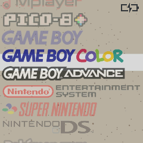
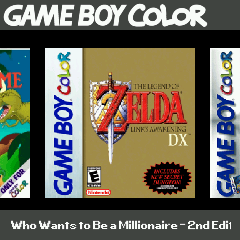

# RetroUI Theme for RetroFE on Funkey OS

Welcome to the **RetroUI** theme! This theme is designed specifically for the RetroFE launcher on Funkey OS, optimized and tested on the RG Nano. PixelPerfect brings a sleek, retro-inspired aesthetic that perfectly complements the RG Nano's compact display and classic gaming experience.

## Features

- **Optimized for RG Nano**: Perfectly tailored for the RG Nano's 240x240 screen resolution.
- **Custom Fonts and Icons**: Designed for readability and style on small screens.

## Installation

Follow these steps to install the PixelPerfect theme on your RetroFE setup:

1. **Download the Theme**:
   - Download the latest release as a ZIP file

2. **Extract the Theme**:
   - If downloaded as a ZIP, extract the contents to a folder on your computer

3. **Copy to Your Device**:
   - Choose the version you want, either color or minimal and copy that specific folder (RetroUI color OR RetroUI minimal)
   - Transfer the theme folder to your Funkey OS SD card: /mnt/Funkey/.retrofe/layouts/
   - Remember to edit the layouts.list that is present on the /mnt/Funkey/.retrofe/layouts/ folder and add a line with the name of the theme (=folder name)

4. **Activate the Theme**:
   - Press the Menu (on/off) button
   - Use the DPad (up/down keys) to find the theme selector
   - Choose the RetroUI theme
   - Confirm selection
   - ENJOY!

## Screenshots

### Color

### Minimal

### Minimal Purple (mPurple)

### Minimal Blue (mBlue)

### Minimal Red (mRed)

To change background:
- Enter the images folder inside the theme folder
- Make sure the background you want is named background.png

## Compatibility

- **Device**: RG Nano (tested), other devices running the [custom Funkey OS Firmware by DrUm78](https://github.com/DrUm78/FunKey-OS/releases/).
- **Launcher**: RetroFE on Funkey OS
- **Resolution**: 240x240

## Feedback and Contributions

Have suggestions, issues, or want to contribute? Feel free to open an issue or submit a pull request on this repository.

## License

This project is licensed under the [MIT License](LICENSE). You are free to use, modify, and distribute this theme as long as attribution is provided.

---

Enjoy the RetroUI experience! 🎮
